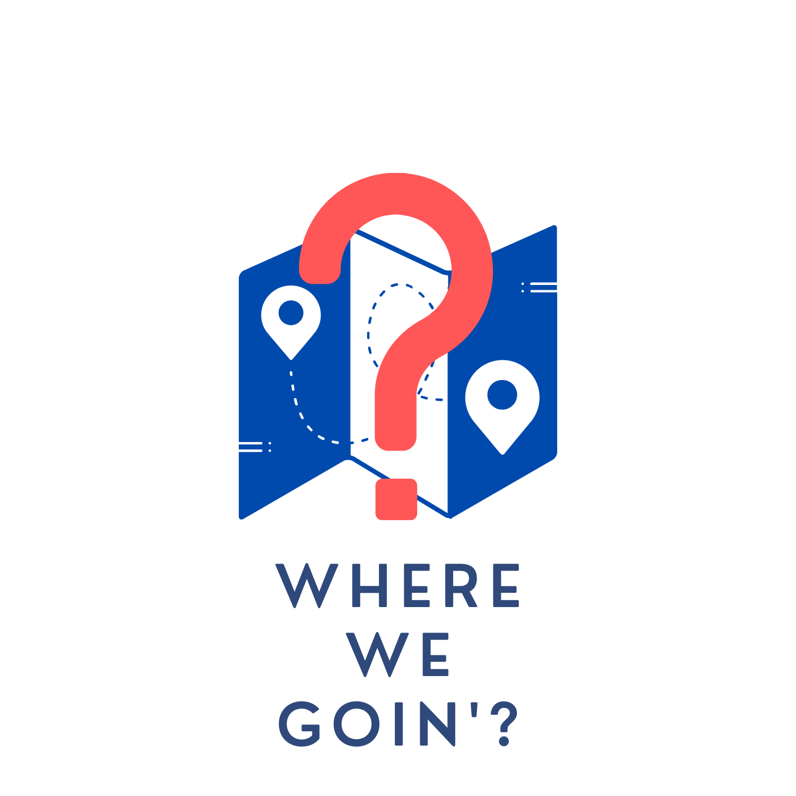

# UNIHACK 2021: TEAM V

### What is WHERE WE  GOIN'?

You're out with your mates and you hangout at the same spot every time. Occasionally, you guys want to try something new, but you guys have no idea what fun activities are around you, and google search shows you the same 10 popular spots that either too far away, or something that you're not interested in. If only there were a way to ease the process to find all the fun activities around you.......
WHERE WE GOIN' (WWG) comes to the recue!!!

### What does WWG look like and offer?
| Home Page| Search by Category|
| ---------------------------------------------------------------------- | ------------------------------------------------------------------ |
|  |  |

WWG offers an amazing UI that shows a user all the 'things do to' nearby, that ranges from restaurants to entertainment options. The user also has the option to find the preferred destination from the categories page. To select a activity, the user has to swipe right on that activity. Otherwise, swipe left to remove an activity.

When the user selects a destination, the page will show few but necessary details such as opening time, distance and how to go there.
| Selected Destination |
| ----------  |
|  |

-----

#### Tech Stack
Flutter, Node.JS, Google Maos API and Firebase. Here's a  [link](https://github.com/xlelx/unihack2021-team-v) where the backend program can be found.
